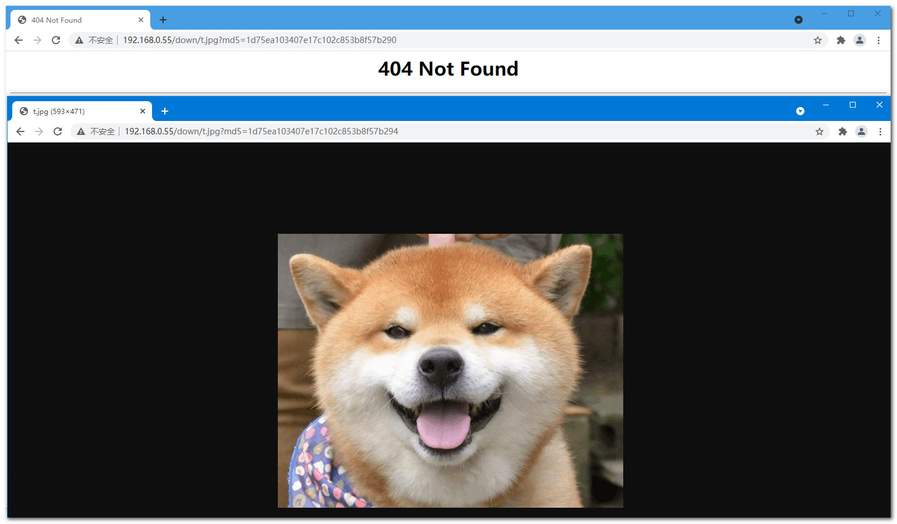

# file_md5 模块
file-md5-master是别人做好的文件md5模块 https://github.com/cfsego/file-md5  

file_md5模块，主要用于静态文件（主要是图片，下载文件等）的访问加上md5限制，假如图片站的图片是有顺序的，可以简单的防止采集。

## 解压nginx
tar xf openresty-1.19.3.1.tar.gz

## 配置编译参数
./configure --prefix=/usr/local/openresty --with-http_ssl_module --with-http_gzip_static_module --with-http_stub_status_module --with-http_realip_module --add-module=../file-md5-master --user=nginx --group=nginx

## 编译安装
make && make install

> ## 如果已经安装nginx，需要增加该模块，注意！！！！请先备份
>> #### 1.先配置编译
>> ./configure --prefix=/usr/local/openresty --with-http_ssl_module --with-http_gzip_static_module --with-http_stub_status_module --with-http_realip_module --add-module=../file-md5-master --user=nginx --group=nginx
>> #### 2.编译
>> make
>> #### 3.替换nginx那个可执行文件
>> cp build/nginx-1.19.3/objs/nginx /usr/local/openresty/nginx/sbin/
>>
>>

## 使用默认配置做测试
1.修改nginx.conf配置文件  
```        
location ~ /down {  
    # ellen  
    # add_header Content-MD5 $file_md5;  
    # 与md5参数进行比对，不匹配返回404页面  
    if ( $arg_md5 != $file_md5 ){  
        return 404;  
    }  
}
```
> 2.在nginx/html中新建目录down  
> mkdir down  
>
> 3.上传一张图片（t.jpg）到服务器，并计算md5，测试直接使用lrzsz包 rz上传（yum -y install lrzsz）  
> 计算md5：在服务器使用md5sum命令计算  
> md5sum t.jpg  
>
> 4.访问静态文件  
> http://192.168.0.55/down/t.jpg?md5=1d75ea103407e17c102c853b8f57b294
>
> http://192.168.0.55/down/t.jpg?md5=1d75ea103407e17c102c853b8f57b290
>
> 
>
>

